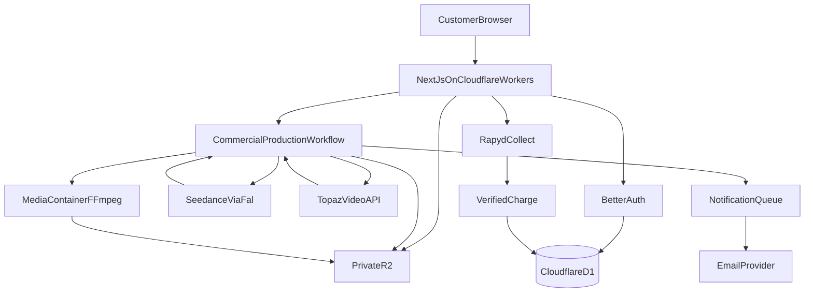

# Production30 architecture

Read with `CINEYOU_MASTER_SPEC.md`. This file records how the product is structured in this repository, not a second spec.

## Product

Production30 produces a 30-second 1080p business commercial starring the customer, without exposing AI tooling.

Customer path:

```text
Tell us about your business
→ Show us who you are
→ Approve your commercial idea
→ Production30 produces it
→ Receive a polished 1080p business advert
```

Internal pipeline:

```text
Brief → Creative Director → Approval → Credit reserved
→ Seedance 2.5 reference-to-video (480p, 30s)
→ Private R2
→ Topaz Video API (1080p)
→ Private R2
→ Cloudflare Container (FFmpeg branding + exact text)
→ Final 1080p MP4 on private R2
→ Dashboard (signed playback/download)
```



## Stack

| Layer | Choice |
| --- | --- |
| App | Next.js App Router, React, TypeScript strict |
| UI | Tailwind + shadcn/ui, Production30 cinema tokens |
| Hosting | Cloudflare Workers via `@opennextjs/cloudflare` |
| DB | Cloudflare D1 + Drizzle (SQLite dialect only) |
| Auth | Better Auth 1.7 (D1 / Drizzle adapter, `transaction: false`) |
| Media | Private R2, object keys in D1 |
| Jobs | Cloudflare Workflows (`CommercialProductionWorkflow`) |
| Side effects | Cloudflare Queues (email, cleanup) |
| Branding encode | Cloudflare Containers + FFmpeg/ffprobe |
| Creative | OpenAI behind `CreativeDirectorProvider` |
| Video gen | Seedance 2.5 via reAPI, 480p |
| Upscale | Topaz Labs Video API, default `prob-4` |
| Payments | Rapyd Collect (ZAR and USD catalog amounts); Payoneer, PayFast, and Paystack adapters unused |
| Email | Resend behind provider abstraction |

Forbidden: Supabase, Postgres-only SQL, public R2 URLs, video bytes in D1, customer-facing provider names.

## Repository layout (target)

```text
app/                          # Next.js App Router (public, dashboard, admin, api)
components/                   # UI (shadcn) + site/dashboard/admin
lib/
  auth/                       # Better Auth factory, session helpers
  authz/                      # requireUser, requireAdmin, requireWorkspace*
  workspaces/                 # create-on-onboarding, invites, role changes, switcher queries
  dashboard/                  # studio context, nav, real summary counts
  businesses/                 # brand create/update, logo metadata
  identity/                   # consent, identity complete/delete, slot mapping
  media/                      # library tabs, complete/delete, MIME allowlist
  projects/                   # commercial brief wizard, draft save/resume
  creative/                   # concept persist, approve, rate limit, public DTO
  ai/creative-director/       # mock + OpenAI Responses structured output
  ai/ad-strategies/           # industry principles, not hardcoded ads
  r2/                         # object keys, MIME allowlist, magic-byte sniff, aws4fetch signed PUT/GET
  security/                   # rate limits, account deletion/export, support tickets, secret checks
  importers/                  # public page meta (og/title only) + unavailable business importer
  studio/                     # Ad Studio lanes, methods, presets (business first, viral second)
  db/                         # Drizzle client + schema
  providers/video/seedance/   # prompt builder (Phase 12); submit/status later
  providers/upscale/topaz/
  providers/payments/
  providers/email/
  workflows/                  # CommercialProductionWorkflow
  containers/                 # MediaProcessingService Durable Object class
  lib/admin/                      # staff overview, job retry/refund/cancel, non-secret settings
  contrast.ts                 # WCAG hex contrast (design phase)
public/brand/                 # replaceable SVG logos
public/production30-homepage/ # sales homepage photographs, backgrounds, UI, icons
containers/media-processing/  # FFmpeg/ffprobe image (Worker → container only)
docs/CINEYOU_*.md
wrangler.jsonc
open-next.config.ts
```

## Cloudflare bindings

| Binding | Resource | Phase |
| --- | --- | --- |
| `DB` | D1 `cineyou-production` | 2 |
| `MEDIA_BUCKET` | R2 `cineyou-production` | 7 |
| `ASSETS` | OpenNext static assets | 1 |
| `WORKER_SELF_REFERENCE` | OpenNext self service | 1 |
| `CommercialProductionWorkflow` | Workflow class | 15 |
| `MediaProcessingService` | Container / Durable Object | 18 |
| `NOTIFICATION_QUEUE` | Queue producer/consumer | 20 |
| `CLEANUP_QUEUE` | Queue | 20 |
| `AUTH_RATE_LIMIT` | Workers Rate Limiting | 23 |
| `PRODUCTION_RATE_LIMIT` | Workers Rate Limiting | 23 |

Secrets (Wrangler secrets / `.dev.vars`, never `NEXT_PUBLIC_*`): `BETTER_AUTH_SECRET`, `R2_ACCOUNT_ID`, `R2_ACCESS_KEY_ID`, `R2_SECRET_ACCESS_KEY`, `REAPI_API_KEY`, `TOPAZ_API_KEY`, `OPENAI_API_KEY`, `RAPYD_ACCESS_KEY`, `RAPYD_SECRET_KEY`, `PAYONEER_TOKEN`, `PAYFAST_MERCHANT_KEY`, `PAYFAST_PASSPHRASE`, `PAYSTACK_SECRET_KEY`, `GOOGLE_CLIENT_SECRET`, `RESEND_API_KEY`, `INTERNAL_SERVICE_SECRET`.

Plain Wrangler `vars` (committed, not secrets): `AI_PROVIDER_MODE=mock`, `FILMING_AI_MODE=live`, `CONCEPT_AI_MODE=live`, `OPENAI_MODEL`, `PAYMENTS_MODE=test`, `RAPYD_MODE=sandbox`, `RAPYD_WEBHOOK_URL=https://production30.thewellmedia.com/api/webhooks/rapyd`. Do not set `PAYMENTS_MODE=live`, `RAPYD_MODE=live`, or `AI_PROVIDER_MODE=live` without an explicit decision. `wrangler secret put` publishes a Worker version — do not run it until deploy is approved.

## Tenancy

D1 has no RLS. Every query and mutation is workspace-scoped in server code.

- User → many workspace memberships (`OWNER` / `ADMIN` / `CREATOR` / `VIEWER`)
- Workspace owns billing and credit wallet
- Business/brand owns commercials
- Presenter identity is per user within a workspace, private R2, never mixed into the media library

Helpers (Phase 4): `requireUser`, `requireAdmin`, `requireWorkspaceMember`, `requireWorkspaceRole`, `requireBusinessAccess`, `requireProjectAccess`, `requireAssetAccess`. Core checks live in `lib/authz/guards.ts` and take `db` + `userId` so they can be tested without Next. Next.js wrappers in `lib/authz/http.ts` call `notFound()` on forbidden access. VIEWER cannot produce. Only OWNER can change billing. Suspended members/workspaces cannot start production. Platform admin is `ADMIN_EMAILS`, not a workspace ADMIN role. Identity assets (`category: identity`) are readable only by the owning user, even when another member shares the workspace.

## Media keys

UUID object keys. Never use customer filenames as authority.

```text
workspaces/{workspaceId}/brands/{businessId}/logo/
workspaces/{workspaceId}/brands/{businessId}/assets/{logo|product|business|location|campaign}/
workspaces/{workspaceId}/users/{userId}/identity/{front|left|right|reference-video}/
workspaces/{workspaceId}/projects/{projectId}/{references|source/seedance|enhanced/topaz|final/master|thumbnails}/
```

Uploads: auth → authorize workspace → short-lived signed PUT (10–20 min) when R2 S3 API tokens are set → browser PUT to R2 → complete. Without tokens (local), the Worker binding `put`s after the same prefix checks. Downloads: auth → authorize asset → short-lived signed GET or authenticated Worker stream. Never persist signed URLs.

## Credits

`credit_wallets.balance` is decremented with a conditional D1 update (`balance >= 1`) plus unique `idempotency_key` on `credit_transactions`. Technical failures may refund once. Creative preference changes cost another credit.

## Provider mode

`AI_PROVIDER_MODE=mock|live` controls enhancement and branding, and is the default for filming and concept when those flags are unset.

`FILMING_AI_MODE=mock|live` controls Filming Your Commercial only. `live` calls reAPI Seedance 2.5. Missing `REAPI_API_KEY` must not silently mock. When unset, filming follows `AI_PROVIDER_MODE`. Mock enhancement keeps the filmed file (no fixture swap) when filming is live.

`CONCEPT_AI_MODE=mock|live` controls Commercial Concept only. `live` calls OpenAI Responses. Missing `OPENAI_API_KEY` must not silently mock. When unset, concept mode follows `AI_PROVIDER_MODE`.

`PAYMENTS_MODE=test|live` is independent. Credits are granted only after a verified Rapyd payment (`status` is `CLO` and `paid` is `true` on `GET /v1/payments/{payment_id}` with signed Collect headers, plus amount/currency/plan checks). Redirect query params never grant credits. `PAYMENTS_MODE=test` with no provider mode uses the mock adapter and makes no HTTP calls. `RAPYD_MODE=sandbox` without keys closes Buy Credits instead of mocking. Live Rapyd credentials in test mode are refused. Sandbox Rapyd is refused when `PAYMENTS_MODE=live`.

## OpenNext + Workflows + Containers

OpenNext generates `.open-next/worker.js`. Production30 does not point Wrangler `main` at that file directly. `worker.ts` re-exports the generated `fetch` handler (and OpenNext cache Durable Objects) and **also** exports `CommercialProductionWorkflow` and `MediaProcessingService`, which Next.js route files cannot register.

```jsonc
{
  "main": "worker.ts",
  "assets": { "directory": ".open-next/assets", "binding": "ASSETS" },
  "workflows": [
    {
      "name": "commercial-production",
      "binding": "COMMERCIAL_PRODUCTION_WORKFLOW",
      "class_name": "CommercialProductionWorkflow"
    }
  ],
  "containers": [
    {
      "class_name": "MediaProcessingService",
      "image": "./containers/media-processing/Dockerfile",
      "instance_type": "standard-1",
      "max_instances": 5
    }
  ]
}
```

Start production with `env.COMMERCIAL_PRODUCTION_WORKFLOW.create({ id: jobId, params })`. Params arrive as `event.payload`. `step.do` results must be JSON-serializable (byte arrays are stored as `number[]`, not `Uint8Array`). Branding writes the final file and thumbnail to R2 inside the step, then persists metadata only.

`next dev` and Wrangler `getPlatformProxy` do not bind Workflows. `/api/production/start` then uses `waitUntil` plus mock providers so the HTTP response still returns immediately. Do not stub fake production progress in the UI. There is no public media-processing HTTP route. The Worker calls the container over the Durable Object binding with `X-Internal-Secret`.

## Customer vs internal status

| Internal | Customer |
| --- | --- |
| `SEEDANCE_QUEUED` / `SEEDANCE_PROCESSING` | Filming Your Commercial |
| Topaz stages | Enhancing Your Footage |
| Branding | Adding Your Brand |
| Finalising | Final Checks |
| `COMPLETE` | Your Commercial Is Ready |

Never fabricate exact ETAs or untrusted percentages.

## Brand

Cinema / agency, not “AI slop”. Tokens in `app/globals.css`. Studio stays on the navy cinema theme. Public marketing and auth use `[data-theme="public"]` (lifted navy, not black). Button fill `#1678FF` with label `#001038`. Public accent text is `#5AA3FF`. Purple `#5A45FC` is logo / loader only.

## Security baseline

- Centralized authz
- Rate limit signup, login, reset, import, concept gen, signed uploads, checkout, production start, support, webhooks
- Webhook signature + idempotent event rows
- Identity consent versioned; adult presenter for MVP
- Account deletion: cancel sub, revoke sessions, schedule R2 delete, retain financial records only
- Admin routes require admin; 2FA architecture for Admin/Owner/Agency
